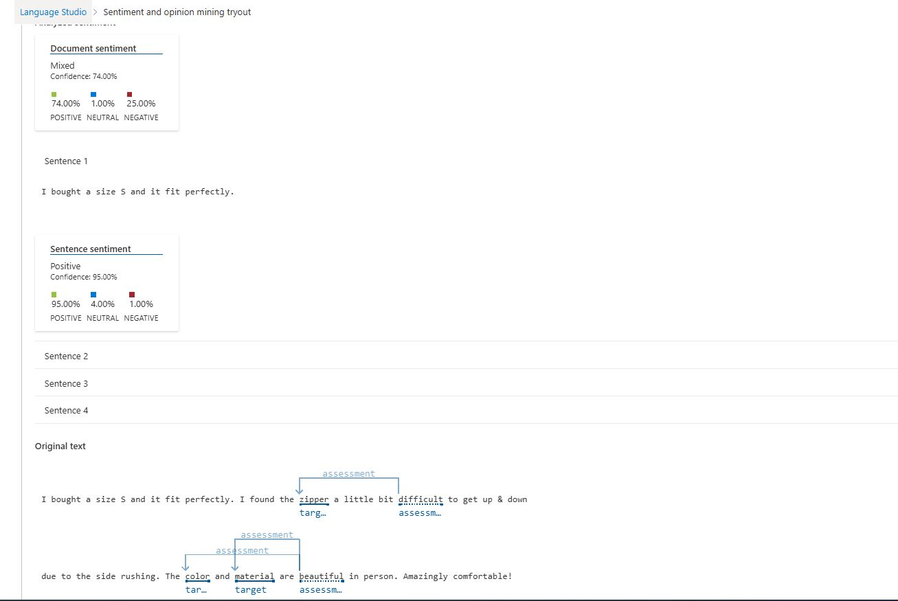

# Análise de sentimentos
----
## Colocamos a sentença que será analisada: 

## Resultado:

----

### Foi possivel aprender que uma análise real do feedback de produtos físicos por exemplo, só é possivel por meio da análise de sentimentos dos comentarios.
